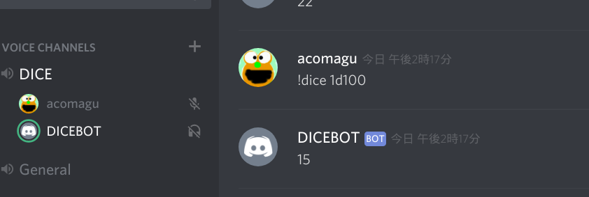

# DICEBOT



クトゥルフTRPGのダイスを振ってくれるDiscord Botです。ボイスチャンネルを通してダイス音を再現します。

## 動作環境

- Go 1.11

環境変数として以下を指定してください。

- DISCORD_TOKEN: Discord Bot Token
- PORT(Optional): ヘルスチェック用のポート番号; デフォルト: 80

`:{PORT}/health` がヘルスチェック用にListenされます。成功で204を返します。

## ビルド

ビルドにはGoとFFmpegが必要です。

初めにダイス音の素材を `dicesound.{{適切な拡張子}}` として同じディレクトリに保存してください。以下がおすすめです。

[ダイス音・2（2D10） - ニコニ･コモンズ](http://commons.nicovideo.jp/material/nc42340)

最後に以下を実行してください。

```
$ make
```

## Docker Imageのビルド

Makeのターゲットに `dockerimage` を指定してください。

```
$ make dockerimage
```
